# The Church

## What is the Church?

## Four Marks of the Church

## Scripture & Tradition

## The Magisterium

## The Pope

## Papal Infallibility

## Apostolic Succession

## Ecumenical Councils

## Catholic Churches & Rites

```mermaid
graph TD
    A[Catholic Church]

    A --> W[West Syriac rite]
    A --> E[East Syriac rite]
    A --> R[Roman rite]
    A --> B[Byzantine rite]
    A --> AR[Armenian rite]
    A --> AL[Alexandrian rite]

    R --> R1[Latin Church]

    B --> B1[Ukrainian Greek Catholic Church]
    B --> B2[Melkite Greek Catholic Church]
    B --> B3[Ruthenian Greek Catholic Church]
    B --> B4[Romanian Greek Catholic Church]
    B --> B5[Greek Byzantine Catholic Church]
    B --> B6[Italo-Albanian Catholic Church]
    B --> B7[Hungarian Greek Catholic Church]
    B --> B8[Slovak Greek Catholic Church]
    B --> B9[Bulgarian Greek Catholic Church]
    B --> B10[Croatian and Serbian Greek Catholic Church]
    B --> B11[Macedonian Greek Catholic Church]
    B --> B12[Belarusian Greek Catholic Church]
    B --> B13[Russian Greek Catholic Church]
    B --> B14[Albanian Greek Catholic Church]

    W --> W1[Maronite Church]
    W --> W2[Syriac Catholic Church]
    W --> W3[Syro-Malankara Catholic Church]

    E --> E1[Chaldean Catholic Church]
    E --> E2[Syro-Malabar Catholic Church]

    AR --> AR1[Armenian Catholic Church]

    AL --> AL1[Coptic Catholic Church]
    AL --> AL2[Ethiopian Catholic Church]
    AL --> AL3[Eritrean Catholic Church]
```

